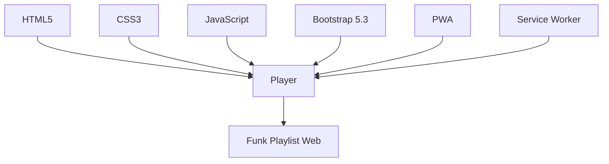

# Funk Playlist Web  
  
  
  
  
  
  

---

<div align="center">

## **FUNK NA VEIA, APP NA TELA**  

**Player de funk 100% offline, instalável e brabo!**  
**191 faixas de MC Ryan SP, MC IG, Boladin 211, Oldilla, MC Cebezinho e +**  

> **Desenvolvido com paixão por Cleverton Rosa**  

[](https://github.com/cleverton-god)  
[](LICENSE)  

</div>

---

## Sobre o Projeto  

**Funk Playlist Web** é um **player de funk moderno, leve e 100% offline** — feito como **Progressive Web App (PWA)**.  
Funciona como um **app nativo**, mas **sem baixar APK**!  

### Destaques  

| Recurso | Descrição |
|--------|-----------|
| **191 Músicas** | MC Ryan SP, MC IG, Boladin 211, Oldilla, MC Hariel, MC Cebezinho, MC Tuto + muito mais |
| **Instalável** | Adicione à tela inicial (Android/iOS/PC) com 1 clique |
| **100% Offline** | Depois do 1º acesso, **toca sem internet** |
| **Controles** | Play/Pause · Próxima · Anterior · Aleatório · Volume · Progresso |
| **Design** | Responsivo · Bootstrap 5.3 · Animações · Scroll suave |
| **Cache Inteligente** | Músicas salvas automaticamente no primeiro play |

---

## Estrutura do Projeto  

```bash
Funk-Playlist-Web/
├── index.html              # Player completo (HTML + JS)
├── manifest.json           # PWA: nome, ícones, tema
├── service-worker.js       # Cache offline + atualização
├── icons/                  # Ícones PWA
│   ├── icon-192.png
│   └── icon-512.png
├── musics/                 # 191 faixas .m4a
│   ├── 300 no 7(M4A_128K).m4a
│   ├── MALVADA - Traplaudo_ MC IG...(M4A_128K).m4a
│   └── ... (191 músicas)
└── README.md               # Você tá lendo!
```

---

## Como Usar  

### **Online (GitHub Pages) — Acesse Agora!**  
[https://cleverton-god.github.io/APP-Music-Player-Web/](https://cleverton-god.github.io/APP-Music-Player-Web/)  

> **Passo a passo:**  
> 1. Abra no **Chrome** (celular ou PC)  
> 2. Toque em **"Instalar App"** (botão verde)  
> 3. Ou: Menu (⋮) → **"Adicionar à tela inicial"**  
> 4. **Pronto!** Ícone na tela, funciona offline  

---

### **Localmente (Clone)**  

```bash
git clone https://github.com/cleverton-god/Funk-Playlist-Web.git
cd Funk-Playlist-Web
```

> Abra `index.html` no navegador  
> **Primeira vez online** → depois **100% offline**

---

## Funcionalidades  

| Ícone | Recurso | Status |
|------|--------|--------|
| Play | Play/Pause | Done |
| Next | Próxima / Anterior | Done |
| Shuffle | Aleatório | Done |
| Progress | Barra de progresso clicável | Done |
| Volume | Volume com slider | Done |
| List | Lista virtual (191 faixas) | Done |
| Highlight | Destaque da faixa atual | Done |
| Responsive | Mobile + Desktop | Done |
| Install | Instalável como app | Done |
| Offline | Funciona sem internet | Done |

---

## Tecnologias  



- **HTML5** → Estrutura  
- **CSS3** → Animações, gradientes, scroll  
- **JavaScript (Vanilla)** → Lógica completa  
- **Bootstrap 5.3** → Layout responsivo  
- **Bootstrap Icons** → Ícones modernos  
- **PWA** → `manifest.json` + `service-worker.js`  
- **Service Worker** → Cache de tudo (músicas inclusas)

---

## Autor  

<div align="center">

**Cleverton Rosa**  
*Desenvolvedor Full Stack | Apaixonado por Funk, PWA e Código Limpo*  

[](https://github.com/cleverton-god)  
[](https://linkedin.com/in/cleverton-rosa)  

> **"Funk não é crime, é cultura. Código não é bagunça, é arte."**

</div>

---

## Licença  

```text
MIT License © Cleverton Rosa
```

> Uso pessoal liberado.  
> **Respeite os direitos autorais das músicas.**

---

<div align="center">

**Feito com grave, café e muito `console.log()`**  
**Funk na veia, app na tela.**

</div>
